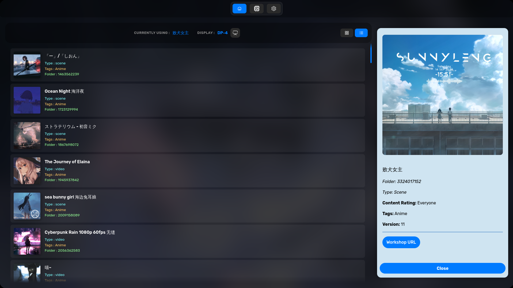
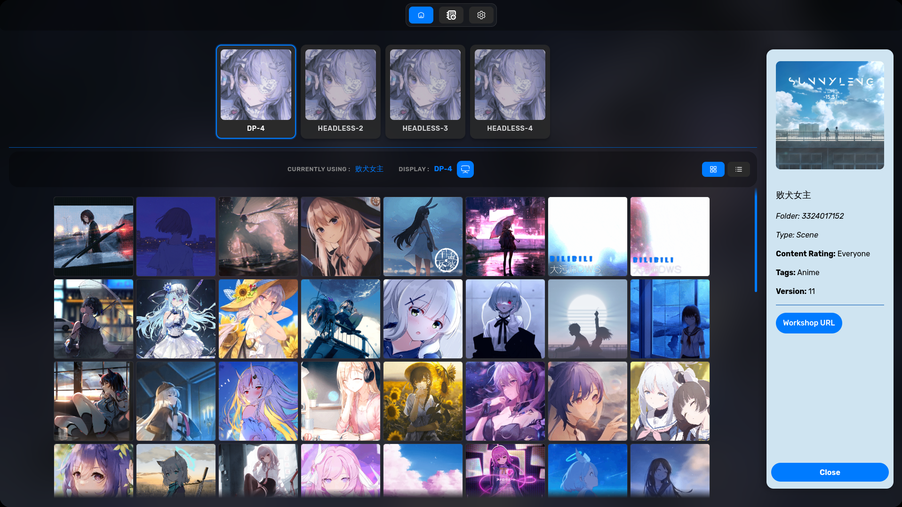
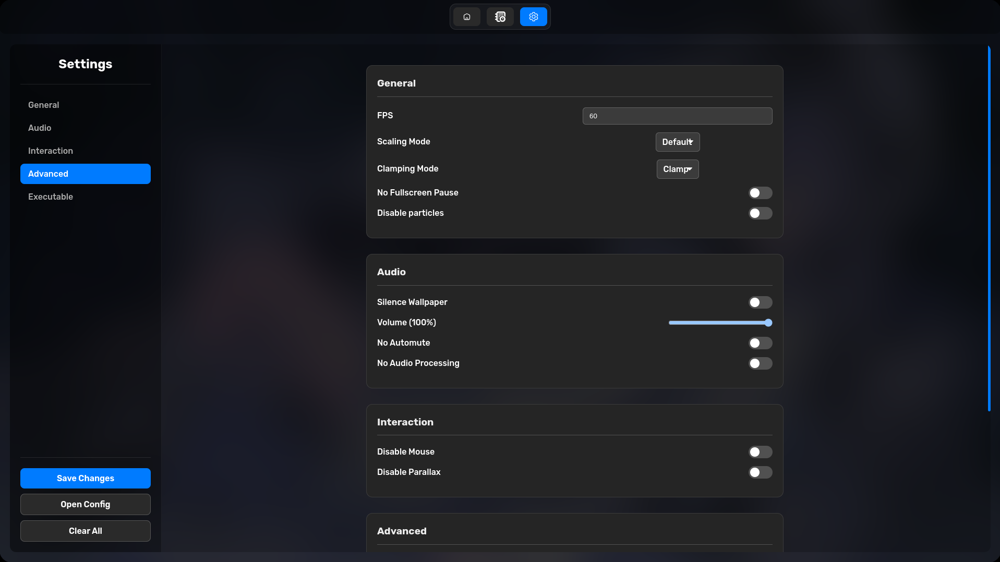

<h1 align="center">
  <br>
  ✦ LINUX WALLPAPER ENGINE GUI ✦
</h1>

<p align="center">
  <strong>◈ A graphical user interface for managing wallpapers on Linux ◈</strong>
  <br>
  <strong>◈ Powered by Go (Backend) and Electron (Frontend) ◈</strong>
</p>

<p align="center">
  <a href="https://github.com/AzPepoze/linux-wallpaperengine-gui/releases/latest">
    
  </a>
  <a href="LICENSE">
    
  </a>
  <a href="https://github.com/AzPepoze/linux-wallpaperengine-gui/stargazers">
    
  </a>
  <a href="https://aur.archlinux.org/packages/linux-wallpaperengine-gui-git">
    
  </a>
  <a href="https://aur.archlinux.org/packages/linux-wallpaperengine-gui-git">
    
  </a>
</p>

## CONTENTS

-    [CONTENTS](#contents)
-    [FEATURES](#features)
-    [MEMORY EFFICIENCY](#memory-efficiency)
-    [SCREENSHOTS](#screenshots)
-    [PREREQUISITES](#prerequisites)
-    [INSTALLATION](#installation)
     -    [Arch Linux (AUR)](#arch-linux-aur)
     -    [Other Distributions](#other-distributions)
-    [USAGE](#usage)
     -    [\[Options\]](#options)
-    [BUILD FROM SOURCE](#build-from-source)
-    [DEVELOPMENT](#development)
-    [CONTRIBUTING](#contributing)
-    [STONKS!](#stonks)

## FEATURES

-    **Wallpaper Management** – Browse and select wallpapers from your Steam Workshop content with ease.
-    **Wallpaper Properties** – Adjust individual wallpaper settings.
-    **Multi-Monitor Support** – Effortlessly choose which screen to apply wallpapers.
-    **Auto-Save & Auto-Run** – Remembers your last used wallpaper and applies it automatically on startup.
-    **Customizable Settings** – Edit settings for linux-wallpaperengine, or edit raw JSON config.
-    **System Tray** – Minimize to the tray for seamless background operation without cluttering your workspace.

## MEMORY EFFICIENCY

I know that many users are scared of Electron applications due to their reputation for being "RAM eaters". This GUI is specifically designed for maximum efficiency to address those concerns:

-    **Go Backend:** A lightweight Go process handles the system tray, configuration, and wallpaper management.
-    **Electron Frontend:** The Electron-based UI is only launched when needed. When you minimize the application to the tray, the Electron process is **completely terminated**, freeing up all the memory it was using.

## SCREENSHOTS

|            Main Window            |
| :-------------------------------: |
|  |

|           Main Window (List)           |
| :------------------------------------: |
|  |

|         Display Settings         |
| :------------------------------: |
|  |

|                Settings                |
| :------------------------------------: |
|  |

## PREREQUISITES

> [!IMPORTANT]
> This application requires [linux-wallpaperengine](https://github.com/Almamu/linux-wallpaperengine) to be installed on your system to function.

## INSTALLATION

### Arch Linux (AUR)

Install using your favorite AUR helper:

```bash
# Using yay
yay -S linux-wallpaperengine-gui-git

# Using paru
paru -S linux-wallpaperengine-gui-git
```

### Other Distributions

Download the latest pre-built binaries (AppImage, deb, rpm) from the [**Releases**](https://github.com/AzPepoze/linux-wallpaperengine-gui/releases/latest) page.

## USAGE

Launch it from your application menu or via terminal:

```bash
linux-wallpaperengine-gui [options]
```

### [Options]

-    `--minimized`: Starts the application minimized in the system tray.

## BUILD FROM SOURCE

**Requirements:**

-    [Go](https://golang.org/) (1.21+)
-    [Node.js](https://nodejs.org/) & [pnpm](https://pnpm.io/)

1. **Clone & Enter:**

     ```bash
     git clone https://github.com/AzPepoze/linux-wallpaperengine-gui
     cd linux-wallpaperengine-gui
     ```

2. **Install Deps:**

     ```bash
     pnpm install
     ```

3. **Build:**

     ```bash
     pnpm run build
     ```

     The output will be in the `dist` directory.

## DEVELOPMENT

Run with hot-reloading:

```bash
pnpm run dev
```

## CONTRIBUTING

Feel free to contribute to this project by opening issues or submitting pull requests.

## STONKS!

<div align="center">
  <a href="https://www.star-history.com/#AzPepoze/linux-wallpaperengine-gui&type=date&legend=top-left">
    <picture>
      <source media="(prefers-color-scheme: dark)" srcset="https://api.star-history.com/svg?repos=AzPepoze/linux-wallpaperengine-gui&type=date&theme=dark&legend=top-left" />
      <source media="(prefers-color-scheme: light)" srcset="https://api.star-history.com/svg?repos=AzPepoze/linux-wallpaperengine-gui&type=date&legend=top-left" />
      
    </picture>
  </a>
  <br>
  <br>
  <strong>✦ Made with ♥︎ by AzPepoze ✦</strong>
</div>
