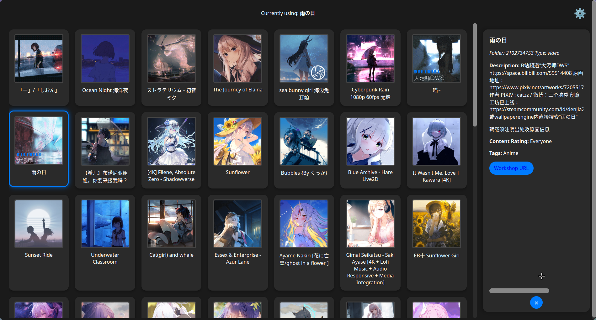
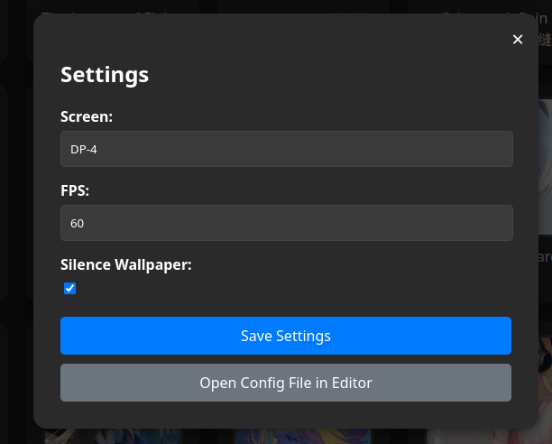

# 🐧 Linux Wallpaper Engine GUI

A graphical user interface for managing wallpapers on Linux, powered by Electron, Svelte, and `linux-wallpaperengine`.

## 📸 Screenshots

#### Main Window



#### Settings Window



## ✨ Features

- 🖼️ **Wallpaper Management:** Browse and select wallpapers from your Steam Workshop content.
- 💾 **Auto-Save & Auto-Run:** Automatically saves the last used wallpaper and applies it on application startup.
- 🔇 **Mute Mode:** A setting to mute the wallpaper process, effectively muting the wallpaper.
- ⚙️ **Customizable Settings:** Configure screen and FPS settings for the wallpaper.
- 🔍 **Wallpaper Details:** View detailed information about each wallpaper, including title, description, tags, and workshop URL.
- 🖥️ **System Tray Integration:** Minimize the application to the system tray for background operation.

## 📋 Prerequisites

Before you begin, ensure you have the following installed:

- 🐧 **[linux-wallpaperengine](https://github.com/Almamu/linux-wallpaperengine):** The command-line tool that this GUI interacts with. You can usually find this in your distribution's repositories or compile it from source.

## 🚀 Installation

You have three options to get the Linux Wallpaper Engine GUI:

### Option 1: Install on Arch Linux 🐧

This method is for users of Arch Linux or Arch-based distributions.

1. **Create a temporary directory and download the PKGBUILD:**
     ```bash
     mkdir -p ~/linux-wallpaperengine-gui-build
     cd ~/linux-wallpaperengine-gui-build
     curl -O https://raw.githubusercontent.com/AzPepoze/linux-wallpaperengine-gui/main/installer/PKGBUILD
     ```
2. **Build and install the package:**

     ```bash
     makepkg -si
     ```

     This command will automatically handle dependencies, build the package, and install it on your system.

3. **Clean up the temporary directory:**
     ```bash
     cd ~ && rm -rf ~/linux-wallpaperengine-gui-build
     ```
4. **Remove pnpm (if you don't use it)**
     ```bash
     sudo pacman -R pnpm
     ```

### Option 2: Download from Releases 📦

You can download pre-built packages for various Linux distributions directly from the GitHub Releases page.

1. **Download the lastest release.**
     - Go to the [Latest Release Page](https://github.com/AzPepoze/linux-wallpaperengine-gui/releases/latest)
       Download the appropriate file for your system (`.AppImage`, `.deb`, `.rpm`, or `.snap`).
     - Click on the link for your desired package type to download it directly.
          - [Click here to download .AppImage file](https://github.com/AzPepoze/linux-wallpaperengine-gui/releases/latest/download/linux-wallpaperengine-gui.AppImage)
          - [Click here to download .deb file](https://github.com/AzPepoze/linux-wallpaperengine-gui/releases/latest/download/linux-wallpaperengine-gui.deb)
          - [Click here to download .rpm file](https://github.com/AzPepoze/linux-wallpaperengine-gui/releases/latest/download/linux-wallpaperengine-gui.rpm)
          - [Click here to download .snap file](https://github.com/AzPepoze/linux-wallpaperengine-gui/releases/latest/download/linux-wallpaperengine-gui.snap)

2. **Install it using your system's package manager.** For example:
     - **For `.AppImage`:**
          ```bash
          chmod +x linux-wallpaperengine-gui.AppImage
          ./linux-wallpaperengine-gui.AppImage
          ```
     - **For `.deb` (Debian, Ubuntu):**
          ```bash
          sudo dpkg -i linux-wallpaperengine-gui.deb
          ```
     - **For `.rpm` (Fedora, CentOS):**
          ```bash
          sudo rpm -i linux-wallpaperengine-gui.rpm
          ```
     - **For `.snap`:**
          ```bash
          sudo snap install linux-wallpaperengine-gui.snap --dangerous
          ```
          (The `--dangerous` flag is needed because the snap is not from the official Snap Store.)

### Option 3: Build from Source 🛠️

If you prefer to build the application yourself, follow these steps:

- **Node.js and pnpm:** Ensure you have Node.js and pnpm installed. These are required to build the Electron application.

1. **Clone the repository:**
     ```bash
     git clone https://github.com/AzPepoze/linux-wallpaperengine-gui.git
     cd linux-wallpaperengine-gui
     ```
2. **Install dependencies:**
     ```bash
     pnpm install
     ```
3. **Build and Unpack:**

     ```bash
     pnpm build:unpack
     ```

     This will create an unpacked application in the `dist/linux-unpacked` directory.

4. **Run the Unpacked Application:**
     ```bash
     ./dist/linux-unpacked/linux-wallpaperengine-gui
     ```

## 💻 Development Mode

To run the application in development mode:

```bash
pnpm dev
```

This will open the GUI.

### Production Build 📦

To build the application for production:

```bash
pnpm build
# or npm build
```

This will create an executable in the `dist` directory.

## 📖 How to Use the GUI

- 🖱️ **Selecting a Wallpaper:** Click on any wallpaper in the grid to set it as your current wallpaper. The application will automatically save your selection.
- ⚙️ **Settings:** Click on the "Settings" button (or equivalent, depending on UI) to open the settings panel. Here you can:
     - 🖥️ Adjust the `SCREEN` (e.g., `DP-1`, `HDMI-A-1`) where the wallpaper will be displayed.
     - ⚡ Set the `FPS` (frames per second) for the wallpaper.
     - 🔇 Toggle **"Mute Wallpaper"** to mute the `linux-wallpaperengine` process and have no active wallpaper.
- ➡️ **Sidebar:** When a wallpaper is selected, a sidebar will appear on the right, showing detailed information about the wallpaper.
- 🔽 **System Tray:** The application minimizes to the system tray when closed, allowing it to run in the background. You can right-click the tray icon to quit the application.

## 🤝 Contributing

Feel free to contribute to this project by opening issues or submitting pull requests.
