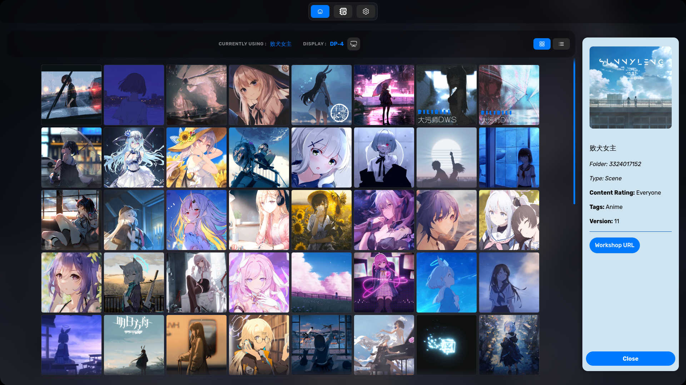
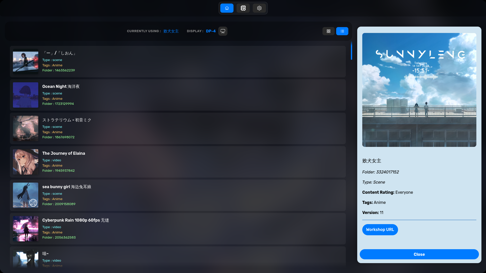
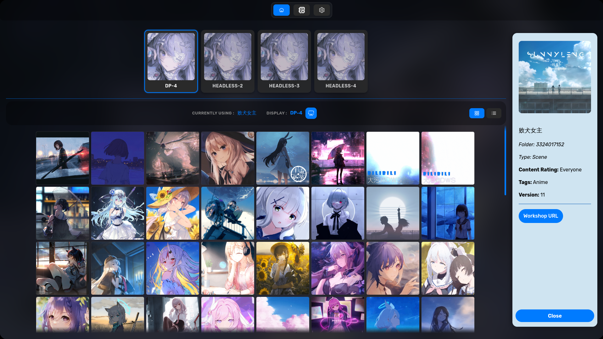
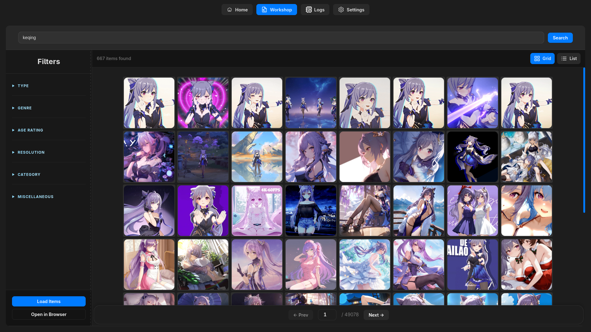
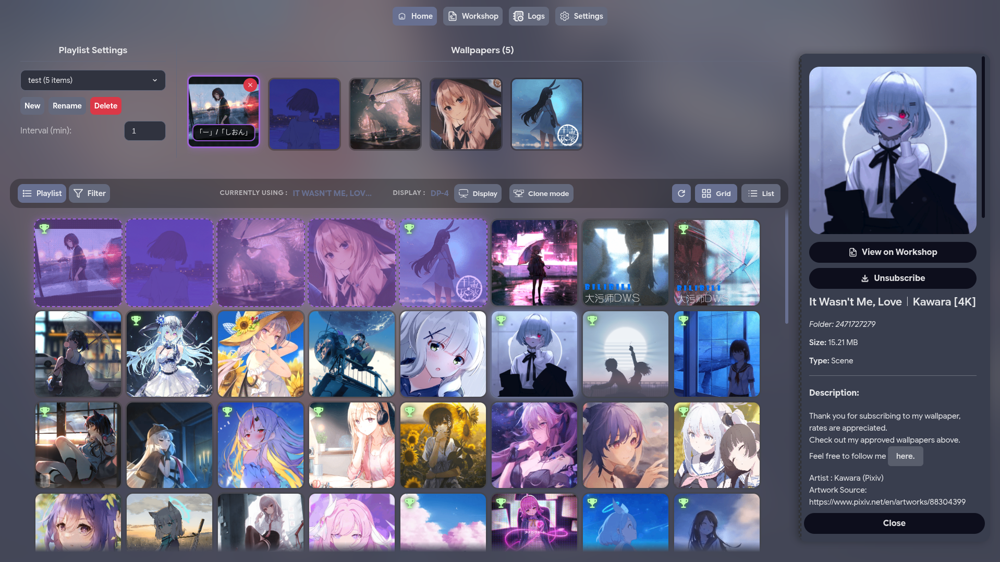
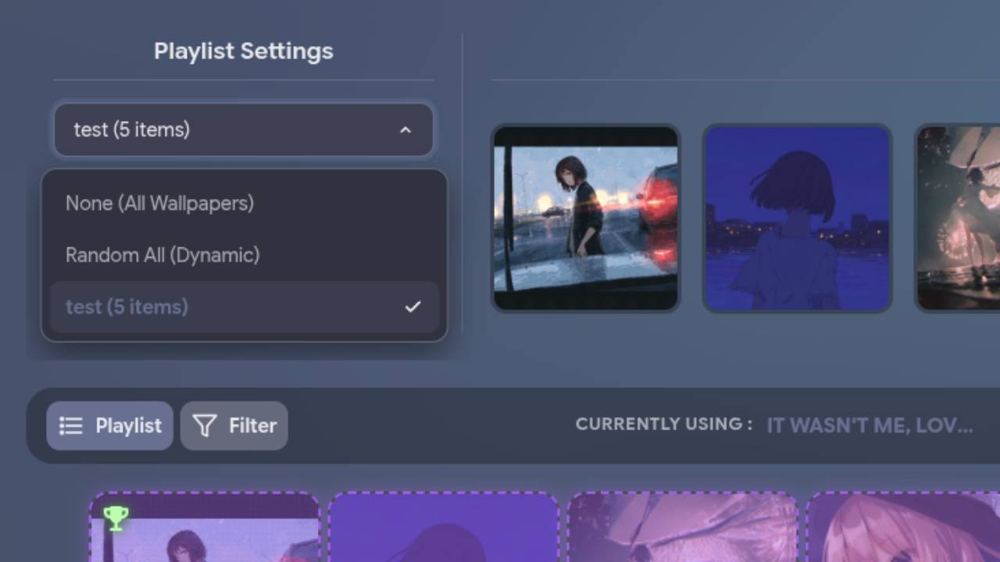
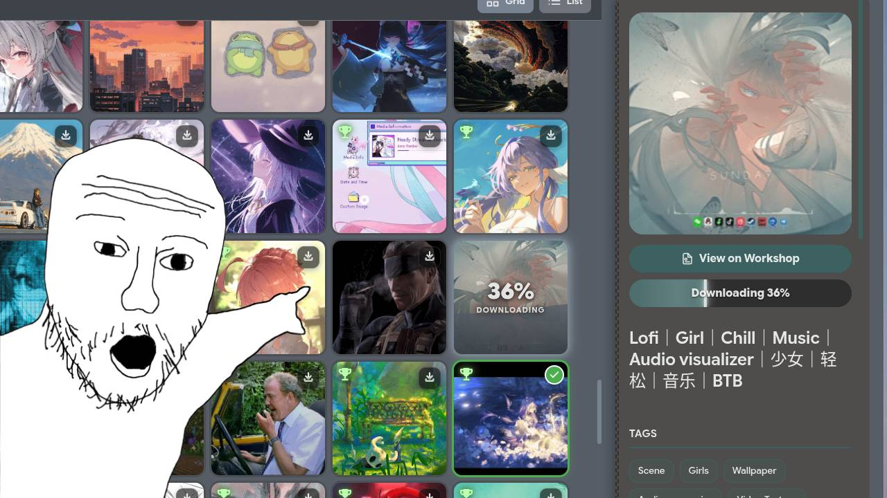
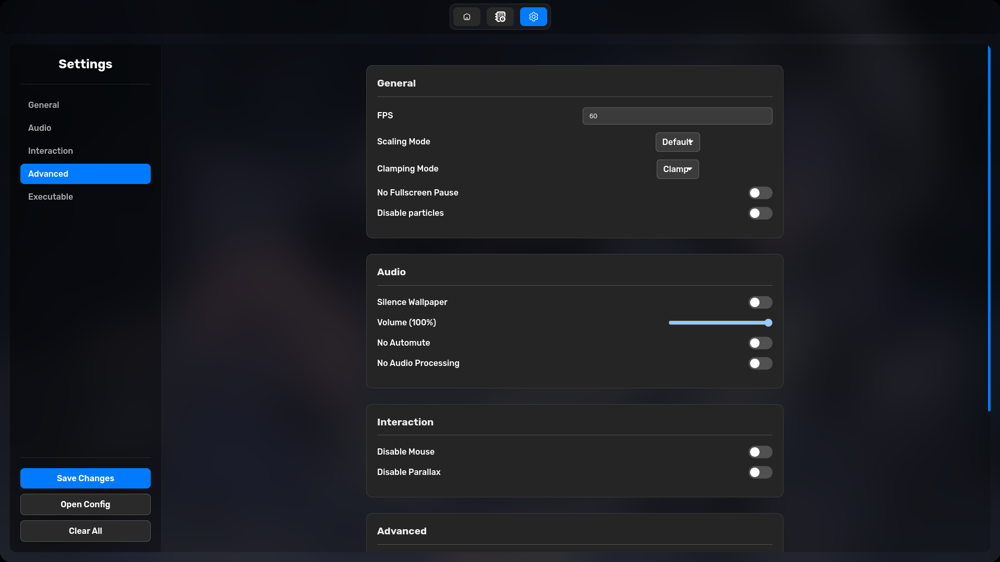

<h1 align="center">
  <br>
  ✦ LINUX WALLPAPER ENGINE GUI ✦
</h1>

<p align="center">
  <strong>◈ A graphical user interface for managing wallpapers for <a href="https://github.com/Almamu/linux-wallpaperengine">linux-wallpaperengine</a> ◈</strong>
  <br>
  <strong>◈ Go backend + Svelte UI + shared Qt 6 WebEngine (Chromium) runtime ◈</strong>
</p>

<p align="center">
  <a href="https://github.com/AzPepoze/linux-wallpaperengine-gui/releases/latest"></a>
  <a href="LICENSE"></a>
  <a href="https://github.com/AzPepoze/linux-wallpaperengine-gui/stargazers"></a>
  <a href="https://aur.archlinux.org/packages/linux-wallpaperengine-gui-git"></a>
  <a href="https://aur.archlinux.org/packages/linux-wallpaperengine-gui-git"></a>
</p>

## CONTENTS

- [SCREENSHOTS](#screenshots)
- [FEATURES](#features)
- [SHARED WEB RUNTIME](#shared-web-runtime)
- [PREREQUISITES](#prerequisites)
- [INSTALLATION](#installation)
- [USAGE](#usage)
- [STEAM WORKSHOP](#steam-workshop)
- [MIGRATION](#migration)
- [BUILD FROM SOURCE](#build-from-source)
- [DEVELOPMENT](#development)

> [!NOTE]
> This GUI is also being developed alongside [AzPepoze/linux-wallpaperengine](https://github.com/AzPepoze/linux-wallpaperengine), a Go implementation of Wallpaper Engine for Linux.

## SCREENSHOTS

| Main Window |
| :--: |
|  |

| Main Window (List) |
| :--: |
|  |

| Display Settings |
| :--: |
|  |

| Workshop |
| :--: |
|  |

| Playlist |
| :--: |
|  |

| Playlist Settings |
| :--: |
|  |

| Workshop Downloading |
| :--: |
|  |

| Settings |
| :--: |
|  |

## FEATURES

| Feature | Description |
|---|---|
| Wallpaper Management | Browse and select wallpapers from Steam Workshop content |
| Steam Workshop Integration | Query, subscribe and track Workshop downloads through the Go backend |
| Playlist Support | Create and manage playlists including dynamic Random All |
| Wallpaper Properties | Adjust individual wallpaper settings |
| Multi-Monitor Support | Individual, clone and span display modes |
| Auto-Save & Auto-Run | Remembers and applies the last configuration on startup |
| Wayland Support | Native Wayland or XWayland UI mode |
| System Tray | Close the Chromium UI process while wallpaper management stays active |
| Shared Chromium Runtime | Uses system Qt WebEngine instead of shipping a Chromium/Electron copy with every app |
| Flatpak | Uses the Qt WebEngine BaseApp and launches linux-wallpaperengine on the host |

## SHARED WEB RUNTIME

This project intentionally **does not bundle Electron or Chromium** on Linux.

The Svelte frontend runs inside a small native **Qt 6-only** host built with **Xmake**. Qt WebEngine is Chromium-based and is supplied by the Linux distribution (or by the Flatpak Qt WebEngine BaseApp), so multiple applications can share the same installed runtime. Qt 5 is not supported and the native build rejects it.

```text
Svelte / Vite
     │
Qt WebChannel
     │
Qt 6 WebEngine host ── system/shared Chromium runtime
     │
Unix socket
     │
Go backend ─────────── wallpaper/config/playlist/Steam Workshop
```

The Qt WebEngine UI is still a separate process tree. Closing the UI to the tray terminates that host, while the lightweight Go backend keeps wallpapers and playlists running.

Linux WebKitGTK is not used as a renderer backend.

## PREREQUISITES

> [!IMPORTANT]
> [linux-wallpaperengine](https://github.com/Almamu/linux-wallpaperengine) must be installed and available on the host system.

A normal distro package also needs the shared Qt 6 runtime components:

- Qt 6 Base
- Qt 6 WebChannel
- Qt 6 WebEngine

For example, on Arch Linux the runtime packages are provided by the normal Qt packages (`qt6-base`, `qt6-webchannel`, `qt6-webengine`). They are dependencies, not copied into this application's package.

## INSTALLATION

### Arch Linux (AUR)

```bash
yay -S linux-wallpaperengine-gui-git
# or
paru -S linux-wallpaperengine-gui-git
```

The AUR package should depend on the system Qt 6 WebEngine packages rather than Electron.

### Flatpak

Release builds provide a `.flatpak` bundle using:

- `org.kde.Platform//6.10`
- `io.qt.qtwebengine.BaseApp//6.10`

Install a downloaded bundle with:

```bash
flatpak install ./linux-wallpaperengine-gui.flatpak
```

The GUI itself runs in the sandbox. Wallpaper rendering is intentionally started on the host with `flatpak-spawn --host`, because `linux-wallpaperengine` is a host application that needs direct compositor/display access.

### Other distributions

The release tarball contains only this project's backend, native Qt host, frontend assets and desktop metadata. It does **not** contain Qt WebEngine/Chromium. Install the Qt 6 runtime dependencies from your distribution, then place the staged files under the corresponding system prefixes.

## USAGE

```bash
linux-wallpaperengine-gui [options]
```

| Option | Description |
|---|---|
| `--minimized` | Start in the system tray without starting the Chromium UI host |
| `--native-wayland` | Run the Qt UI with the native Wayland platform instead of XWayland |
| `--debug-mode` | Enable debug mode and Qt WebEngine remote debugging |

## STEAM WORKSHOP

Steam Workshop integration now lives in the Go backend instead of `steamworks.js`/Node.

The backend uses a narrow C++ bridge over Steamworks' flat C ABI and dynamically loads the official Steamworks redistributable (`libsteam_api.so`) at runtime. The Steamworks SDK/binary is **not vendored from unofficial mirrors into this repository**.

If `libsteam_api.so` is not on the loader path, set:

```bash
export LWE_STEAM_API_LIBRARY=/path/to/libsteam_api.so
```

When an authorized Steamworks redistributable is unavailable, the rest of the application continues to work and the Workshop integration reports Steam as unavailable instead of failing the GUI startup.

For Flatpak, this same rule applies: a redistributable must be provided through an authorized packaging source before native Workshop calls can be enabled. The Flatpak does not silently copy a Steamworks binary from the host or an unofficial mirror.

## MIGRATION

Older Electron releases may have left Chromium cache data under `~/.config/linux-wallpaperengine-gui/`. It is no longer used by the Qt shared-runtime build and can be removed:

```bash
rm -rf ~/.config/linux-wallpaperengine-gui/{Cache,Code\ Cache,GPUCache,DawnGraphiteCache,DawnWebGPUCache,blob_storage,Local\ Storage,Session\ Storage,Crashpad,SharedStorage,Dictionaries,Shared\ Dictionary,DIPS}
```

Thanks to [@CrasAtHeri](https://github.com/CrasAtHeri) for the original cache cleanup note.

## BUILD FROM SOURCE

Requirements:

- Go
- Bun
- Xmake + a C++20 compiler
- Qt 6 Base development files
- Qt 6 WebChannel development files
- Qt 6 WebEngine development files
- GTK/AppIndicator development files used by the existing Go tray backend

On Arch Linux, the native/UI build dependencies can be installed with:

```bash
sudo pacman -S xmake qt6-base qt6-webchannel qt6-webengine
```

Then:

```bash
git clone https://github.com/AzPepoze/linux-wallpaperengine-gui
cd linux-wallpaperengine-gui
bun install
bun run build
```

`bun run build:native` configures Xmake for the Qt 6 major line and the `xmake.lua` target rejects a detected Qt 5 SDK.

The staged browser-free install tree is written to `dist/linux-unpacked`, and a tarball is written to `dist/`.

To build a local Flatpak after the normal build:

```bash
flatpak remote-add --user --if-not-exists flathub https://flathub.org/repo/flathub.flatpakrepo
bun run flatpak
```

## DEVELOPMENT

`bun run dev` builds the Go backend and Xmake-based Qt 6 host, starts Vite on `127.0.0.1:5173`, and opens the development frontend in the Qt WebEngine host with hot reload:

```bash
bun run dev
```

The renderer bridge is exposed as `window.runtimeAPI`. `window.electronAPI` currently remains as a compatibility alias while existing Svelte components are migrated to the platform-neutral name.

<div align="center">
  <br>
  <strong>✦ Made with ♥︎ by AzPepoze ✦</strong>
</div>
