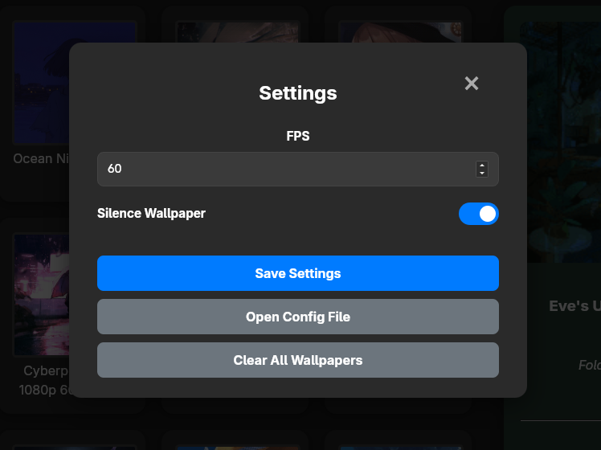

# 🐧 Linux Wallpaper Engine GUI

A graphical user interface for managing wallpapers on Linux, powered by Neutralinojs, Svelte, and `linux-wallpaperengine`.

## 📸 Screenshots

#### Main Window


#### Settings Window



## ✨ Features

- 🖼️ **Wallpaper Management:** Browse and select wallpapers from your Steam Workshop content.
- 💾 **Auto-Save & Auto-Run:** Automatically saves the last used wallpaper and applies it on application startup.
- 🔇 **Mute Audio:** A setting to mute the wallpaper's audio.
- ⚙️ **Customizable Settings:** Configure screen and FPS settings for the wallpaper.
- 🔍 **Wallpaper Details:** View detailed information about each wallpaper, including title, description, tags, and workshop URL.
- 🖥️ **System Tray Integration:** Minimize the application to the system tray for background operation.

## 📋 Prerequisites

Before you begin, ensure you have the following installed:

- 🐧 **[linux-wallpaperengine](https://github.com/Almamu/linux-wallpaperengine):** The command-line tool that this GUI interacts with. You can usually find this in your distribution's repositories or compile it from source.

## 🚀 Installation

You can download pre-built binaries for various Linux distributions directly from the GitHub Releases page.

1.  **Download the latest release for your system.**
    -   Go to the [Latest Release Page](https://github.com/AzPepoze/linux-wallpaperengine-gui/releases/latest)
2.  **Extract the archive and run the application.**

### Install on Arch Linux

If you are using Arch Linux, you can build and install the application using the provided `PKGBUILD`. This will build and install a package named `linux-wallpaperengine-gui-git`.

```bash
mkdir -p /tmp/linux-wallpaperengine-gui-build && \
cd /tmp/linux-wallpaperengine-gui-build && \
curl -O https://raw.githubusercontent.com/AzPepoze/linux-wallpaperengine-gui/main/installer/PKGBUILD && \
makepkg -si && \
cd ~ && \
rm -rf /tmp/linux-wallpaperengine-gui-build
```

## ▶️ Usage

Once installed, you can run the application in two ways:

-   **Normal Mode:** Simply execute the application file. This will open the main window.
    ```bash
    ./linux-wallpaperengine-gui-linux_x64
    ```
-   **Minimized Mode:** Run the application with the `--minimized` flag to start it directly in the system tray without showing the main window.
    ```bash
    ./linux-wallpaperengine-gui-linux_x64 --minimized
    ```

## 📖 How to Use the GUI

-   🖱️ **Selecting a Wallpaper:** Click on any wallpaper in the grid to set it as your current wallpaper. The application will automatically save your selection.
-   ⚙️ **Settings:** Click on the "Settings" button to open the settings panel. Here you can:
    -   🖥️ Adjust the `SCREEN` (e.g., `DP-1`, `HDMI-A-1`) where the wallpaper will be displayed.
    -   ⚡ Set the `FPS` (frames per second) for the wallpaper.
    -   🔇 Toggle **"Mute Wallpaper Audio"** to mute the audio of the wallpaper.
-   ➡️ **Sidebar:** When a wallpaper is selected, a sidebar will appear on the right, showing detailed information about the wallpaper.
-   🔽 **System Tray:** The application minimizes to the system tray when closed, allowing it to run in the background. You can right-click the tray icon to quit the application.

## 💻 Development

For those who want to contribute or build the application from source.

### Build from Source 🛠️

-   **Prerequisites:** Ensure you have Node.js and pnpm installed.

1.  **Clone the repository:**
    ```bash
    git clone https://github.com/AzPepoze/linux-wallpaperengine-gui.git
    cd linux-wallpaperengine-gui
    ```
2.  **Install dependencies:**
    ```bash
    cd app
    pnpm install
    ```
3.  **Build the application:**
    ```bash
    pnpm build
    ```
    This will create a distributable in the `dist` directory.

### Development Mode

To run the application with hot-reloading for development:

```bash
cd app
pnpm dev
```

## 🤝 Contributing

Feel free to contribute to this project by opening issues or submitting pull requests.
